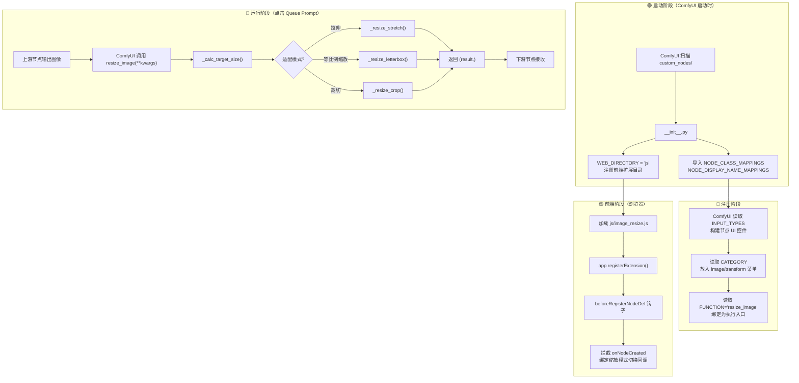

Read [](file:///e%3A/ComfyUI_Python/custom_nodes/Comfyui_ToolKit/nodes/image_resize.py)

Read [](file:///e%3A/ComfyUI_Python/custom_nodes/Comfyui_ToolKit/__init__.py)

Read [](file:///e%3A/ComfyUI_Python/custom_nodes/Comfyui_ToolKit/js/image_resize.js)

## 项目构成总览



---

## 文件职责

| 文件 | 职责 |
|------|------|
| __init__.py | 入口：导出节点映射表，声明前端 JS 目录 |
| image_resize.py | 核心：定义节点类、控件声明、图像处理逻辑 |
| image_resize.js | 前端：操控浏览器端控件禁用/启用行为 |

---

## 完整调用时序

### 阶段一：ComfyUI 启动（Python 后端）

```
ComfyUI 启动
  └─ 遍历 custom_nodes/ 下所有插件
       └─ import Comfyui_ToolKit.__init__
            ├─ from .nodes.image_resize import NODE_CLASS_MAPPINGS, NODE_DISPLAY_NAME_MAPPINGS
            │    └─ 执行 image_resize.py 模块级代码（定义类，构建 NODE_CLASS_MAPPINGS 字典）
            │        ⚠️ 此时类已定义，但没有任何方法被调用
            │
            └─ WEB_DIRECTORY = "js"
                 └─ ComfyUI 记录：该插件有前端资源在 js/ 目录
```

此时 `INPUT_TYPES`、`_calc_target_size`、`resize_image` 等**全部未被调用**，仅完成类的语法定义。

### 阶段二：节点注册（Python 后端）

```
ComfyUI 节点注册系统
  └─ 读取 ImageResizeTool 类的元信息
       ├─ INPUT_TYPES()  ← 🔥 此时首次调用！返回控件定义
       │    └─ ComfyUI 据此构建节点的输入槽位和控件面板
       ├─ RETURN_TYPES = ("IMAGE",)  → 输出类型
       ├─ FUNCTION = "resize_image"  → 执行入口方法名
       ├─ CATEGORY = "image/transform"  → 菜单分类
       └─ NODE_DISPLAY_NAME_MAPPINGS["ImageResizeTool"] = "图像缩放工具"
```

### 阶段三：前端加载（浏览器）

```
用户打开 ComfyUI 网页
  └─ 浏览器加载 js/image_resize.js
       └─ app.registerExtension({...})
            └─ beforeRegisterNodeDef(nodeType, nodeData) 注册钩子
                 └─ 等待 "ImageResizeTool" 节点类型注册

ComfyUI 前端注册 ImageResizeTool 节点类型
  └─ 触发 beforeRegisterNodeDef 钩子
       └─ 包装 nodeType.prototype.onNodeCreated
```

### 阶段四：用户拖入节点（浏览器）

```
用户从菜单拖入"图像缩放工具"节点
  └─ onNodeCreated() 触发  ← 🔥 JS 钩子执行
       ├─ 查找"缩放模式""缩放比例""长边尺寸"三个控件
       ├─ 调用 updateWidgets() 设置初始禁用状态
       │    └─ 默认"按比例缩放" → "长边尺寸"控件变灰
       └─ 绑定"缩放模式"控件的 callback
            └─ 用户切换模式时自动更新禁用状态
```

### 阶段五：执行工作流（Python 后端）

```
用户点击 Queue Prompt
  └─ ComfyUI 按工作流拓扑顺序执行节点
       └─ 轮到 ImageResizeTool 节点时
            ├─ 收集所有输入槽位的值（图像 tensor + 控件值）
            ├─ 调用 resize_image(**kwargs)  ← 🔥 核心执行
            │    ├─ 从 kwargs 提取参数 → image, resize_mode, scale, ...
            │    ├─ _calc_target_size(h, w, ...)  ← 计算目标宽高
            │    │    ├─ 判断 aspect_w/aspect_h 是否均 >0 → 决定是否用自定义比例
            │    │    ├─ "按比例缩放" → 长边 × scale，短边由比例反算
            │    │    └─ "按长边缩放" → 长边固定，短边等比例/自定义比例
            │    │
            │    ├─ 根据 fit_mode 分发：
            │    │    ├─ "拉伸"   → _resize_stretch()   → F.interpolate 直接缩放
            │    │    ├─ "等比例缩放" → _resize_letterbox() → 等比缩放 + 黑边填充
            │    │    └─ "裁切"   → _resize_crop()      → 等比覆盖 + 中心裁切
            │    │
            │    └─ return (result,)  ← 必须返回元组
            │
            └─ ComfyUI 将输出传给下游节点
```

---

## 关键设计点

**为什么用 `**kwargs`？** ComfyUI 根据 `INPUT_TYPES` 的键名（中文）向执行函数传参。如果函数签名写 `resize_image(self, 缩放模式, ...)` 则必须用中文参数名。使用 `**kwargs` 后，签名无中文，内部通过 `kwargs["缩放模式"]` 提取再赋给英文变量，UI 保持中文显示。

**为什么 `_calc_target_size` 可以直接用英文参数？** 它是内部静态方法，由 `resize_image` 调用而非 ComfyUI 框架调用，参数名不受 `INPUT_TYPES` 约束。

**JS 为什么需要 `onNodeCreated` 包装？** 必须先调用原始 `onNodeCreated`（ComfyUI 用它在创建节点后构建控件列表），之后才能通过 `this.widgets.find()` 查找控件并操作 `disabled` 属性。